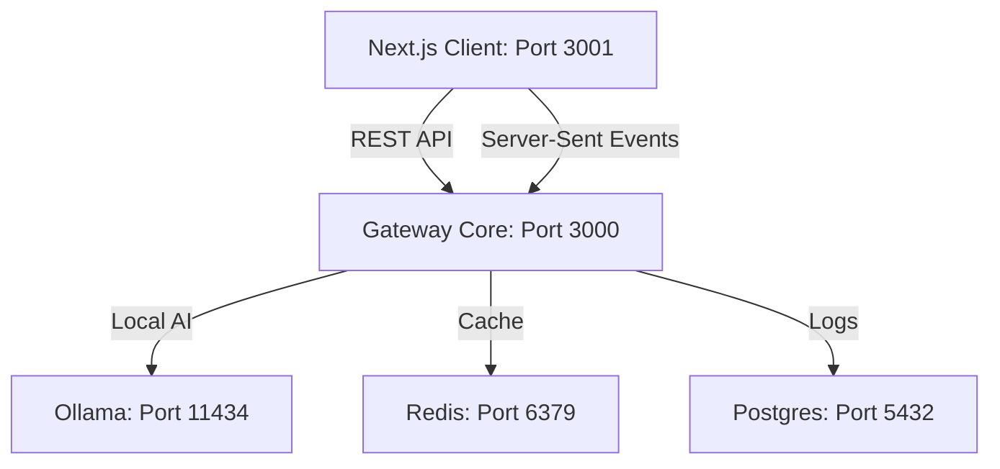

# Enterprise AI Gateway Control Plane & Employee Portal

This folder is the unified web portal interface for the Enterprise AI Gateway Platform. It features two isolated user experiences: a conversational chat assistant for daily employees and a dense, real-time administrative console for SREs and managers.

## 1. System Architecture

The frontend is built using Next.js 15 (App Router, React 19) and integrates with the live API Gateway on port `3000` via:
- **REST APIs**: For configuration changes, metric reads, database logs, and chat completions.
- **Server-Sent Events (SSE)**: For zero-latency operational metrics streams on the dashboard and live requests monitor.



## 2. Folder Structure

```
apps/control-plane/
├── app/
│   ├── layout.tsx           ← Theme and providers setup
│   ├── page.tsx             ← Landing selection route
│   ├── portal/              ← Employee Portal (conversational chat)
│   └── admin/               ← Admin Dashboard (Datadog/Grafana style)
│       ├── dashboard/       ← High-level telemetry charts
│       ├── monitor/         ← Real-time log monitor (SSE)
│       ├── providers/       ← Provider state toggling & score engines
│       ├── routing/         ← Pipeline route visualizer
│       ├── policies/        ← Visual rule engines
│       ├── cache/           ← Semantic cache efficiency metrics
│       ├── security/        ← Prompt Injection / CCCD logs
│       └── settings/        ← Rate limit config & global strategy
└── src/
    ├── lib/
    │   ├── api.ts           ← Fetch utilities
    │   └── types.ts         ← Shared TypeScript types
    └── components/
        └── providers.tsx    ← React Query context
```

## 3. How to Run

The control plane is completely containerized. Simply spin up the docker composition:

```bash
docker compose up -d --build
```

Access the interfaces:
- **Landing Selector**: `http://localhost:3001`
- **Employee Portal**: `http://localhost:3001/portal`
- **Admin Control Plane**: `http://localhost:3001/admin/dashboard`

## 4. Key Features

- **Employee Chat Portal**: Conversational layout, markdown renderer, model/strategy drop-downs, and a collapsible "Execution Details" panel displaying latency, tokens, cost, PII scans, and provider target info.
- **Live Requests Monitor**: Automatically prepends incoming logs using Server-Sent Events (SSE). Select a request to inspect prompt inputs/outputs.
- **Routing Visualizer**: Displays a visual step-by-step pipeline from scanner to provider.
- **Provider Hub & Score Radar**: Score explanation using multivariable radar charts. Disable/Enable adapters instantly.
- **Cache & Financial Dashboards**: Hit ratios, monthly cost trends, and accumulative savings from semantic caching.
- **Security Guardrails**: Audit trails of blocked prompt injections and masked Citizen CCCDs.

## 5. Known Limitations

- **Auth Session Bypass**: For showcase utility, a valid pre-signed JWT is automatically injected to authorize completions requests.
- **Database Logs Cap**: Circular buffers store up to 500 requests in gateway memory to prevent leaks. In a high-traffic production system, this should query PG partition tables directly.
