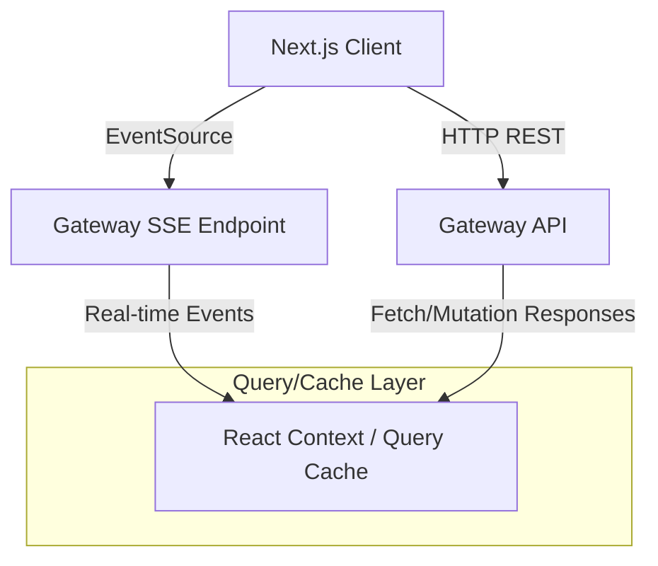

# Frontend Architecture — Enterprise AI Gateway Control Plane

This document describes the high-level frontend architecture, data flows, routing, and portal isolation design for the Enterprise AI Gateway Control Plane.

## Core Technology Stack

- **Framework**: Next.js 15 (App Router, React 19)
- **Styling**: Tailwind CSS (v4)
- **State Management**:
  - **Server State**: `@tanstack/react-query` (v5) for caching, pagination, and automated revalidation.
  - **Real-time State**: Server-Sent Events (SSE) via native `EventSource` for live dashboard metrics and requests.
  - **UI State**: React Context & local component state.
  - **Form State**: `react-hook-form` + `zod` for schemas.
- **Charts**: `recharts` for rich metrics rendering.
- **Icons**: `lucide-react` for standard UI symbols.

## Multi-Portal Architecture

The application is structured into two completely separate workspaces under a unified App Router layout:

```
apps/control-plane/src/app/
├── (auth)/                  ← Auth flow routes (Login / Register)
├── portal/                  ← Employee Portal (Gemini/ChatGPT-like UX)
│   ├── layout.tsx           ← Employee sidebar & workspace state
│   ├── page.tsx             ← Chat Interface
│   └── history/             ← Saved chats & document uploads
└── admin/                   ← Admin Control Plane (Datadog/AWS Console UX)
    ├── layout.tsx           ← Admin sidebar & collapsible sections
    ├── page.tsx             ← Dashboard Redirect
    ├── dashboard/           ← Top level operational metrics
    ├── monitor/             ← Live Request Monitor (SSE)
    ├── routing/             ← Visual routing node diagram
    ├── providers/           ← Provider state, enable/disable & score explainer
    ├── policies/            ← Visual policy rule builder
    ├── costs/               ← Cost analytics & charts
    ├── security/            ← PII and Jailbreak security monitor
    ├── cache/               ← Redis semantic cache efficiency dashboard
    ├── logs/                ← Logs Explorer with filters
    ├── settings/            ← System-wide configuration
    └── docs/                ← Swagger & System Architecture docs
```

## State Management and Data Sync Flow



## Authentication & Authorization Model

1. **Token Storage**: JWT stored in `localStorage` or Secure Cookies.
2. **Gateway Verification**: The frontend includes the `Authorization: Bearer <JWT>` header in all requests.
3. **Role-Based Access Control (RBAC)**:
   - **Employees**: Only have access to `/portal` paths.
   - **Administrators**: Have access to both `/portal` and `/admin`.
   - Access to `/admin` is guarded by Next.js Middleware.
