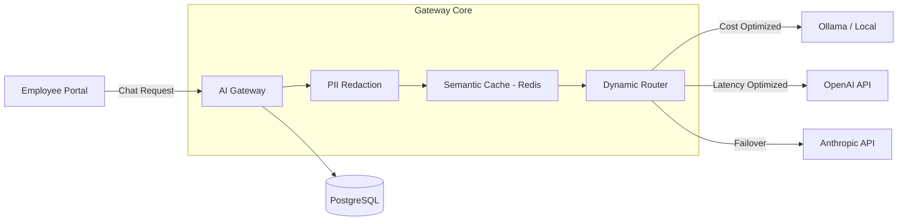

<div align="center">
  <p align="right">
    <strong>English</strong> | <a href="README.vi.md">Tiếng Việt</a>
  </p>
  
  <h1 align="center">Enterprise AI Platform & Gateway</h1>
  <p align="center">
    A production-ready, commercial-grade AI Gateway and Employee Portal.
    Secure, route, and optimize LLM usage across your entire organization.
  </p>
  <p align="center">
    <a href="#features"><strong>Features</strong></a> · 
    <a href="#architecture"><strong>Architecture</strong></a> · 
    <a href="#quick-start"><strong>Quick Start</strong></a> · 
    <a href="#deployment"><strong>Deployment</strong></a>
  </p>
</div>

<hr />

## 🚀 Overview

The **Enterprise AI Platform** is a unified gateway and chat interface designed to solve the three biggest challenges of adopting Generative AI in large organizations: **Security, Cost, and Vendor Lock-in**.

Instead of allowing employees to use fragmented AI tools directly, they access a unified **Employee Portal**. Behind the scenes, the **AI Gateway** automatically routes requests to the optimal model (OpenAI, Anthropic, local Ollama, etc.), redacts sensitive PII data on the fly, caches redundant queries to save costs, and provides IT with a comprehensive admin dashboard.

## ✨ Key Features

### 🛡️ Enterprise Security & Compliance
- **PII Redaction Engine:** Automatically detects and masks Phone Numbers, Emails, and Credit Cards before data leaves your network.
- **Prompt Injection Defense:** Blocks malicious jailbreak attempts to protect underlying systems.
- **Audit Logging:** Every prompt, response, and policy decision is traced and logged in PostgreSQL.

### 🧠 Intelligent Routing & Resilience
- **Dynamic Model Routing:** Automatically route requests based on configurable strategies (`Cost-Optimized`, `Latency-Optimized`, `Balanced`).
- **Circuit Breaker:** Automatically failover to backup providers (e.g., from OpenAI to AWS Bedrock) if a provider experiences an outage. No downtime for end-users.
- **Model Agnostic:** Plug-and-play support for OpenAI, Anthropic, Google Gemini, Ollama, vLLM, Groq, and more.

### 💰 FinOps & Cost Optimization
- **Semantic Caching:** Uses Redis to cache responses for similar questions, returning answers in <50ms and reducing API costs by up to 40%.
- **Cost Analytics Dashboard:** Track token usage and costs down to the individual user, department, and provider level.
- **Local Fallback:** Force non-critical queries to hit local self-hosted models (Ollama) to save cloud API credits.

### 💻 Dual-Interface
- **Employee Portal:** A sleek, user-friendly ChatGPT-like interface for daily employee use.
- **Admin Control Plane:** A comprehensive dashboard for IT to manage providers, routing rules, users, and view live telemetry.

---

## 🏗 Architecture



## 🛠 Tech Stack

- **Frontend:** Next.js 15 (App Router), React, Tailwind CSS, Lucide Icons, Recharts
- **Backend:** Node.js, Fastify, TypeScript, Prisma ORM
- **Database & Cache:** PostgreSQL, Redis
- **Containerization:** Docker & Docker Compose

---

## ⚡ Quick Start (Local Development)

The easiest way to run the platform locally is using Docker.

### Prerequisites
- [Docker & Docker Compose](https://www.docker.com/products/docker-desktop)
- Node.js 20+

### 1-Click Run
```bash
# Clone the repository
git clone https://github.com/yourusername/enterprise-ai-platform.git
cd enterprise-ai-platform

# Start the database, cache, backend, and frontend
docker-compose up -d
```

### Accessing the Platform
- **Employee Portal:** `http://localhost:3000/en/portal`
- **Admin Dashboard:** `http://localhost:3000/en/admin`
- **Gateway API:** `http://localhost:3001`

*(Default Admin Account: admin@enterprise.local / admin123)*

---

## 🌍 Cloud Deployment (Production)

To make this accessible as a public website for your team, you can deploy the components to modern cloud providers:

1. **Database:** Deploy PostgreSQL and Redis on [Supabase](https://supabase.com) or [Aiven](https://aiven.io).
2. **Backend Gateway:** Deploy the Fastify server (`apps/gateway`) to [Render](https://render.com) or [Railway](https://railway.app).
3. **Frontend Portal:** Deploy the Next.js app (`apps/control-plane`) to [Vercel](https://vercel.com) or [Netlify](https://netlify.com).

*Detailed production deployment guides coming soon.*

---

## 📸 Screenshots

*(Replace these placeholders with actual screenshots of your application)*

| Employee Portal | Admin Dashboard |
| :---: | :---: |
| 
 | 
|

| Routing Configuration | Cost Analytics |
| :---: | :---: |
| 
 | 
 |

---

## 📄 License

This project is licensed under the MIT License - see the [LICENSE](LICENSE) file for details.
