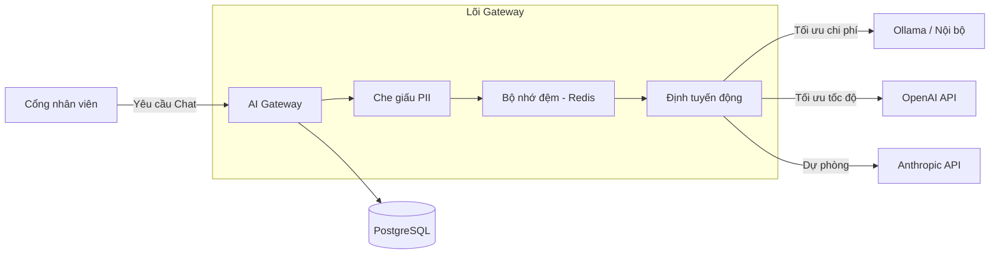

<div align="center">
  <p align="right">
    <a href="README.md">English</a> | <strong>Tiếng Việt</strong>
  </p>
  
  <h1 align="center">Enterprise AI Platform & Gateway</h1>
  <p align="center">
    Nền tảng Cổng AI (AI Gateway) và Cổng thông tin nhân viên (Employee Portal) cấp doanh nghiệp.
    Bảo mật, định tuyến và tối ưu hoá chi phí sử dụng LLM cho toàn bộ tổ chức của bạn.
  </p>
  <p align="center">
    <a href="#tính-năng"><strong>Tính năng</strong></a> · 
    <a href="#kiến-trúc"><strong>Kiến trúc</strong></a> · 
    <a href="#hướng-dẫn-cài-đặt"><strong>Cài đặt nhanh</strong></a> · 
    <a href="#triển-khai"><strong>Triển khai</strong></a>
  </p>
</div>

<hr />

## 🚀 Tổng quan

**Enterprise AI Platform** là một hệ thống gateway và giao diện chat hợp nhất được thiết kế để giải quyết 3 thách thức lớn nhất khi áp dụng AI Tạo sinh (Generative AI) vào doanh nghiệp: **Bảo mật, Chi phí, và Phụ thuộc nhà cung cấp**.

Thay vì để nhân viên sử dụng trực tiếp các công cụ AI rời rạc, họ sẽ truy cập vào một **Cổng thông tin nhân viên** duy nhất. Ở phía sau, **AI Gateway** sẽ tự động định tuyến các câu hỏi đến mô hình tối ưu nhất (OpenAI, Anthropic, Ollama cục bộ, v.v.), che giấu dữ liệu nhạy cảm (PII) theo thời gian thực, lưu trữ bộ nhớ đệm (cache) để tiết kiệm chi phí, và cung cấp cho phòng IT một bảng điều khiển quản trị toàn diện.

## ✨ Tính năng chính

### 🛡️ Bảo mật & Tuân thủ doanh nghiệp
- **Bộ máy che giấu PII:** Tự động phát hiện và che giấu Số điện thoại, Email, và Thẻ tín dụng trước khi dữ liệu rời khỏi mạng nội bộ của bạn.
- **Phòng thủ Prompt Injection:** Chặn các nỗ lực tấn công "vượt rào" (jailbreak) để bảo vệ hệ thống.
- **Nhật ký kiểm toán (Audit Logging):** Mọi câu hỏi, câu trả lời, và quyết định định tuyến đều được theo dõi và lưu vào PostgreSQL.

### 🧠 Định tuyến thông minh & Tính sẵn sàng cao
- **Định tuyến mô hình động:** Tự động định tuyến các yêu cầu dựa trên các chiến lược có thể cấu hình (`Tối ưu chi phí`, `Tối ưu tốc độ`, `Cân bằng`).
- **Cầu dao tự động (Circuit Breaker):** Tự động chuyển đổi sang các nhà cung cấp dự phòng (ví dụ: từ OpenAI sang AWS Bedrock) nếu một nhà cung cấp bị sập. Đảm bảo người dùng không bị gián đoạn.
- **Không phụ thuộc mô hình:** Hỗ trợ ngay lập tức OpenAI, Anthropic, Google Gemini, Ollama, vLLM, Groq, và nhiều hơn nữa.

### 💰 FinOps & Tối ưu hoá chi phí
- **Bộ nhớ đệm ngữ nghĩa (Semantic Caching):** Sử dụng Redis để lưu trữ câu trả lời cho các câu hỏi tương tự, trả về kết quả trong <50ms và giảm tới 40% chi phí API.
- **Bảng phân tích chi phí:** Theo dõi số lượng token và chi phí đến từng người dùng, phòng ban và nhà cung cấp.
- **Ưu tiên mạng nội bộ:** Ép các truy vấn không quan trọng chạy qua các mô hình tự host nội bộ (Ollama) để tiết kiệm chi phí API đám mây.

### 💻 Giao diện kép
- **Cổng thông tin nhân viên:** Giao diện giống ChatGPT, đẹp mắt và dễ sử dụng cho nhân viên hàng ngày.
- **Bảng điều khiển quản trị (Admin):** Bảng điều khiển toàn diện dành cho IT để quản lý nhà cung cấp, quy tắc định tuyến, người dùng và xem dữ liệu trực tiếp.

---

## 🏗 Kiến trúc



## 🛠 Công nghệ sử dụng

- **Frontend:** Next.js 15 (App Router), React, Tailwind CSS, Lucide Icons, Recharts
- **Backend:** Node.js, Fastify, TypeScript, Prisma ORM
- **Cơ sở dữ liệu & Cache:** PostgreSQL, Redis
- **Đóng gói:** Docker & Docker Compose

---

## ⚡ Hướng dẫn cài đặt (Môi trường phát triển)

Cách dễ nhất để chạy nền tảng này trên máy tính của bạn là sử dụng Docker.

### Yêu cầu
- [Docker & Docker Compose](https://www.docker.com/products/docker-desktop)
- Node.js 20+

### Chạy bằng 1 click
```bash
# Clone dự án về máy
git clone https://github.com/danggvuu/enterprise-ai-platform.git
cd enterprise-ai-platform

# Khởi động database, cache, backend, và frontend
docker-compose up -d
```

### Truy cập hệ thống
- **Cổng thông tin nhân viên:** `http://localhost:3000/vi/portal`
- **Bảng điều khiển quản trị:** `http://localhost:3000/vi/admin`
- **Gateway API:** `http://localhost:3001`

*(Tài khoản Admin mặc định: admin@enterprise.local / admin123)*

---

## 🌍 Triển khai đám mây (Môi trường thực tế)

Để biến hệ thống này thành một trang web công khai cho toàn bộ công ty truy cập, bạn có thể triển khai lên các dịch vụ đám mây hiện đại:

1. **Database:** Triển khai PostgreSQL và Redis trên [Supabase](https://supabase.com) hoặc [Aiven](https://aiven.io).
2. **Backend Gateway:** Triển khai server Fastify (`apps/gateway`) lên [Render](https://render.com) hoặc [Railway](https://railway.app).
3. **Frontend Portal:** Triển khai ứng dụng Next.js (`apps/control-plane`) lên [Vercel](https://vercel.com) hoặc [Netlify](https://netlify.com).

---

## 📸 Ảnh chụp màn hình

| Cổng nhân viên | Bảng điều khiển quản trị |
| :---: | :---: |
|  |  |

| Cấu hình định tuyến | Phân tích chi phí |
| :---: | :---: |
|  |  |

---

## 📄 Giấy phép

Dự án này được cấp phép theo Giấy phép MIT - xem file [LICENSE](LICENSE) để biết thêm chi tiết.
