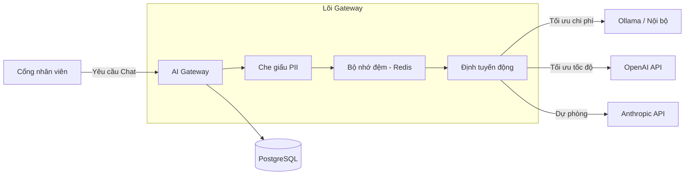

<div align="center">
  <p align="right">
    <a href="README.md">English</a> | <strong>Tiếng Việt</strong>
  </p>
  
  <h1 align="center">Nền tảng Kinh doanh AI & SaaS (AI Gateway)</h1>
  <p align="center">
    Một cỗ máy SaaS đa người thuê (multi-tenant) sẵn sàng cho môi trường Production, giúp bạn bán lại API AI hoặc cung cấp các Cổng ChatGPT tùy chỉnh cho doanh nghiệp (B2B SaaS).
    Quản lý, thu phí, bảo mật và tối ưu hóa LLM cho khách hàng của bạn.
  </p>
  <p align="center">
    <a href="#tính-năng"><strong>Mô hình Kinh doanh</strong></a> · 
    <a href="#kiến-trúc"><strong>Kiến trúc</strong></a> · 
    <a href="#hướng-dẫn-cài-đặt"><strong>Cài đặt nhanh</strong></a> · 
    <a href="#triển-khai"><strong>Triển khai</strong></a>
  </p>
</div>

<hr />

## 🚀 Mô hình Kinh doanh (Monetization Models)

Nền tảng này không chỉ là một công cụ quản lý nội bộ — nó được thiết kế như một **Cỗ máy kinh doanh SaaS hoàn chỉnh** giúp bạn tạo ra doanh thu từ làn sóng AI:

1. **Bán sỉ API AI (Mô hình OpenRouter):** Chạy các mô hình miễn phí (Ollama) trên máy chủ riêng hoặc mua sỉ API từ OpenAI/Anthropic. Bán lại API Key cho các lập trình viên hoặc công ty khác. Hệ thống sẽ đếm chính xác từng Token, trừ tiền trong tài khoản của khách (Pay-as-you-go), và tự động khóa nếu khách hết tiền.
2. **Cho thuê Cổng AI Doanh nghiệp (White-label B2B SaaS):** Bán các hệ thống ChatGPT nội bộ mang thương hiệu riêng (White-label) cho các doanh nghiệp không rành công nghệ (Công ty Luật, Bệnh viện, Bất động sản). Quản lý hàng chục khách hàng (Organizations) trên cùng một hạ tầng duy nhất và thu phí thuê bao $500+/tháng cho mỗi khách.
3. **Chợ Công cụ AI (AI Tool Marketplace):** Xây dựng các Prompt và Trợ lý AI được lập trình sẵn. Người dùng (End-users) nạp tiền (mua Credit) vào hệ thống để được dùng các công cụ này. Bạn thu phần lợi nhuận chênh lệch khổng lồ giữa giá Credit và giá gốc của API.

## ✨ Tính năng chính

### 💰 Hệ thống Thanh toán & Kiến trúc Đa người thuê
- **Bộ đếm Token & Tính tiền (Billing):** Mỗi một prompt/response đều được tính toán chính xác chi phí tới từng con số thập phân và gán cho đúng tài khoản người dùng/tổ chức.
- **Quản lý Quota & Hạn mức (Pay-as-you-go):** Thiết lập ngân sách tối đa cho từng tổ chức (Organization) để đảm bảo không bị đội chi phí API.
- **Cách ly dữ liệu an toàn:** Cho phép lưu trữ dữ liệu của hàng chục công ty khách hàng khác nhau trên cùng một máy chủ mà vẫn bảo đảm tính riêng tư tuyệt đối.

### 🛡️ Bảo mật & Tuân thủ doanh nghiệp
- **Bộ máy che giấu PII:** Tự động phát hiện và che giấu Số điện thoại, Email, và Thẻ tín dụng trước khi dữ liệu rời khỏi mạng nội bộ của bạn.
- **Phòng thủ Prompt Injection:** Chặn các nỗ lực tấn công "vượt rào" (jailbreak) để bảo vệ hệ thống.
- **Nhật ký kiểm toán (Audit Logging):** Mọi câu hỏi, câu trả lời, và quyết định định tuyến đều được theo dõi và lưu vào PostgreSQL.

### 🧠 Định tuyến thông minh & Tính sẵn sàng cao
- **Định tuyến mô hình động:** Tự động định tuyến các yêu cầu dựa trên các chiến lược có thể cấu hình (`Tối ưu chi phí`, `Tối ưu tốc độ`, `Cân bằng`).
- **Cầu dao tự động (Circuit Breaker):** Tự động chuyển đổi sang các nhà cung cấp dự phòng (ví dụ: từ OpenAI sang AWS Bedrock) nếu một nhà cung cấp bị sập. Đảm bảo người dùng không bị gián đoạn.
- **Không phụ thuộc mô hình:** Hỗ trợ ngay lập tức OpenAI, Anthropic, Google Gemini, Ollama, vLLM, Groq, và nhiều hơn nữa.

### 💰 FinOps & Tối ưu hoá chi phí
- **Bộ nhớ đệm ngữ nghĩa (Semantic Caching):** Sử dụng Redis để lưu trữ câu trả lời cho các câu hỏi tương tự, trả về kết quả trong <50ms và giảm tới 40% chi phí API.
- **Bảng phân tích chi phí:** Theo dõi số lượng token và chi phí đến từng người dùng, phòng ban và nhà cung cấp.
- **Ưu tiên mạng nội bộ:** Ép các truy vấn không quan trọng chạy qua các mô hình tự host nội bộ (Ollama) để tiết kiệm chi phí API đám mây.

### 💻 Giao diện kép
- **Cổng thông tin nhân viên:** Giao diện giống ChatGPT, đẹp mắt và dễ sử dụng cho nhân viên hàng ngày.
- **Bảng điều khiển quản trị (Admin):** Bảng điều khiển toàn diện dành cho IT để quản lý nhà cung cấp, quy tắc định tuyến, người dùng và xem dữ liệu trực tiếp.

---

## 🏗 Kiến trúc



## 🛠 Công nghệ sử dụng

- **Frontend:** Next.js 15 (App Router), React, Tailwind CSS, Lucide Icons, Recharts
- **Backend:** Node.js, Fastify, TypeScript, Prisma ORM
- **Cơ sở dữ liệu & Cache:** PostgreSQL, Redis
- **Đóng gói:** Docker & Docker Compose

---

## ⚡ Hướng dẫn cài đặt (Môi trường phát triển)

Cách dễ nhất để chạy nền tảng này trên máy tính của bạn là sử dụng Docker.

### Yêu cầu
- [Docker & Docker Compose](https://www.docker.com/products/docker-desktop)
- Node.js 20+

### Chạy bằng 1 click
```bash
# Clone dự án về máy
git clone https://github.com/danggvuu/enterprise-ai-platform.git
cd enterprise-ai-platform

# Khởi động database, cache, backend, và frontend
docker-compose up -d
```

### Truy cập hệ thống
- **Cổng thông tin nhân viên:** `http://localhost:3000/vi/portal`
- **Bảng điều khiển quản trị:** `http://localhost:3000/vi/admin`
- **Gateway API:** `http://localhost:3001`

*(Tài khoản Admin mặc định: admin@enterprise.local / admin123)*

---

## 🌍 Triển khai đám mây (Môi trường thực tế)

Để biến hệ thống này thành một trang web công khai cho toàn bộ công ty truy cập, bạn có thể triển khai lên các dịch vụ đám mây hiện đại:

1. **Database:** Triển khai PostgreSQL và Redis trên [Supabase](https://supabase.com) hoặc [Aiven](https://aiven.io).
2. **Backend Gateway:** Triển khai server Fastify (`apps/gateway`) lên [Render](https://render.com) hoặc [Railway](https://railway.app).
3. **Frontend Portal:** Triển khai ứng dụng Next.js (`apps/control-plane`) lên [Vercel](https://vercel.com) hoặc [Netlify](https://netlify.com).

---

## 📸 Ảnh chụp màn hình

| Cổng nhân viên | Bảng điều khiển quản trị |
| :---: | :---: |
| |  |
| Cấu hình định tuyến | Phân tích chi phí |
| :---: | :---: |
| | |

---

## 📄 Giấy phép

Dự án này được cấp phép theo Giấy phép MIT - xem file [LICENSE](LICENSE) để biết thêm chi tiết.
