# UI Mockups & Detailed Specifications

This document provides visual wireframes, ASCII layout mockups, and Mermaid representations for every page in the Employee Portal and Admin Control Plane.

---

## Part 1: Employee Portal Mockup (Gemini/ChatGPT-like UX)

### Chat Interface Wireframe

```
+-----------------------------------------------------------------------------------+
| [=] Workspaces  |  New Chat (+)                                       [User Profile] |
+-----------------+-----------------------------------------------------------------+
| History         |                                                                 |
| - Yesterday's.. |                    Enterprise AI Assistant                     |
| - Budget report |                                                                 |
| - Hello world   |  +-----------------------------------------------------------+  |
|                 |  | User: Explain Dynamic Routing.                            |  |
|                 |  +-----------------------------------------------------------+  |
|                 |  | Assistant: Dynamic Routing uses real-time metrics...       |  |
|                 |  |                                                           |  |
|                 |  | [v] Show Execution Details                                |  |
|                 |  | +-------------------------------------------------------+ |  |
|                 |  | | Provider: Ollama | Latency: 142ms | Cache: MISS       | |  |
|                 |  | | PII: None        | Cost: $0.0000  | Strategy: Balanced| |  |
|                 |  | +-------------------------------------------------------+ |  |
|                 |  +-----------------------------------------------------------+  |
|                 |                                                                 |
|                 |  +-----------------------------------------------------------+  |
|                 |  | [Attach Files]  Ask anything...                   [Send >]  |
|                 |  +-----------------------------------------------------------+  |
+-----------------+-----------------------------------------------------------------+
```

---

## Part 2: Admin Control Plane Mockups (11 Modules)

### 1. Dashboard Module
```
+-----------------------------------------------------------------------------------+
|  [Logo] Enterprise AI Admin  |  Strategy: [ Balanced v ]          [Active / Healthy] |
+-----------------------------------------------------------------------------------+
| Sidebar         |  DASHBOARD                                                      |
|                 |  +------------------+  +------------------+  +------------------+ |
| > Dashboard     |  | Total Requests   |  | Avg Latency      |  | Today's Cost     | |
| - Live Requests |  | 1,245k (+12%)    |  | 245 ms           |  | $4.25 (-3%)      | |
| - Providers     |  +------------------+  +------------------+  +------------------+ |
| - Routing       |                                                                   |
| - Policies      |  +-------------------------------------------------------------+ |
| - Guardrails    |  | Live Traffic Rate (Requests / min)                          | |
| - Cache         |  |   |--\                                                      | |
| - Costs         |  |   |   \___/\                                                | |
| - Settings      |  +-------------------------------------------------------------+ |
+-----------------+-----------------------------------------------------------------+
```

### 2. Provider Management Module
```
+-----------------------------------------------------------------------------------+
| Providers       |  Status  | Latency | Availability | Score | Actions             |
+-----------------+----------+---------+--------------+-------+---------------------+
| OpenAI          |  ACTIVE  |  340ms  |    99.98%    |   85  | [Disable] [Configure]|
| AWS Bedrock     |  ACTIVE  |  410ms  |    99.95%    |   72  | [Disable] [Configure]|
| Ollama (Local)  |  ACTIVE  |   52ms  |   100.00%    |   92  | [Disable] [Configure]|
+-----------------------------------------------------------------------------------+
```

### 3. Routing Visualizer Engine (Interactions Diagram)

```mermaid
graph LR
    Req[Incoming Request] --> Scan[Prompt Scanner]
    Scan --> PII[PII Detector]
    PII --> Policy[Routing Policy Engine]
    Policy --> Score[Provider Score Engine]
    Score --> Breaker[Circuit Breaker Check]
    Breaker --> Select[Selected Provider]
    Select --> Resp[Streamed Response]
    
    style Req fill:#1e1e2e,stroke:#3b82f6,stroke-width:2px;
    style Select fill:#1e293b,stroke:#10b981,stroke-width:2px;
```



### 4. Policy Engine Builder Wireframe
```
+-----------------------------------------------------------------------------------+
| Create New Routing Policy Rule                                                    |
+-----------------------------------------------------------------------------------+
|  IF: [ Request Context.ContainsPII    v ] [ equals v ] [ true            ]       |
|                                                                                   |
|  THEN: [ Force Compliance Tag          v ] [ equals v ] [ gdpr            ]       |
|                                                                                   |
|  [ Save Policy Rule ]                                                             |
+-----------------------------------------------------------------------------------+
```

### 5. Cost Analytics Dashboard
```
+-----------------------------------------------------------------------------------+
|  Cost Breakdown by Provider                                                       |
|                                                                                   |
|   [#### OpenAI ($124.50)]  [####### AWS Bedrock ($240.20)]  [ (Ollama: $0) ]       |
+-----------------------------------------------------------------------------------+
```

### 6. Cache Efficiency Dashboard
```
+--------------------------------------------------------------------+
| Cache Hits vs Misses                                               |
|  Hits: [================== 45% ]                                  |
|  Misses: [====================== 55% ]                            |
+--------------------------------------------------------------------+
```

### 7. Security Dashboard
```
+--------------------------------------------------------------------+
| Blocked Security Violations Log                                    |
+--------------------------------------------------------------------+
| Timestamp | Type             | User     | Action Taken             |
+-----------+------------------+----------+--------------------------+
| 10:24:02  | Prompt Injection | user-3   | Rejected (400)           |
| 10:18:11  | PII Detected     | user-1   | Masked / GDPR Routing    |
+--------------------------------------------------------------------+
```
