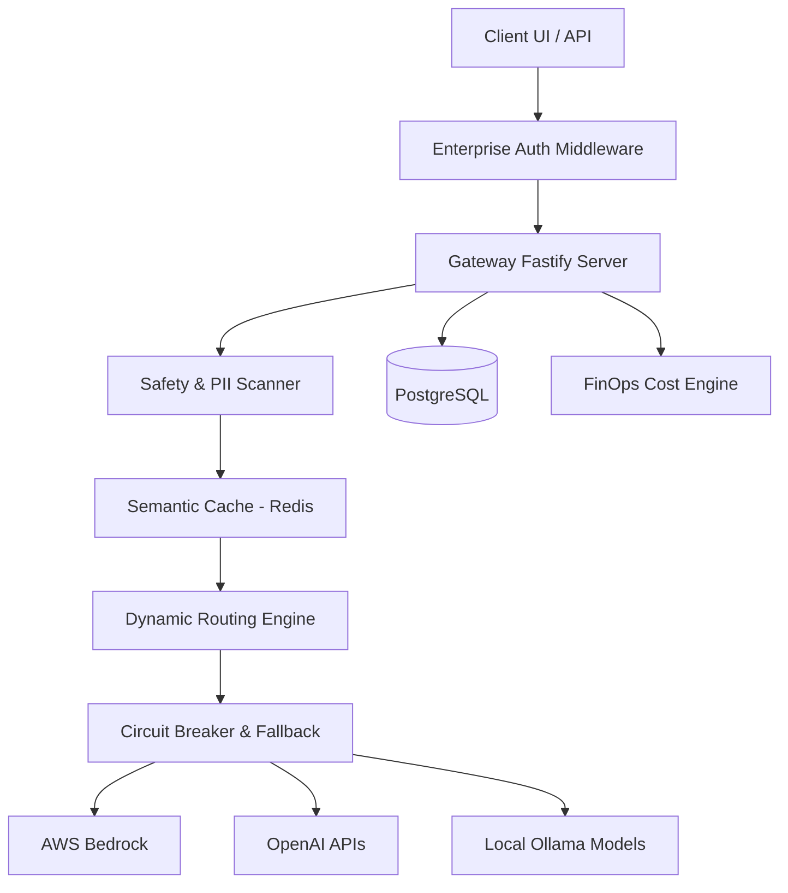

# Enterprise AI Gateway Architecture

## High-Level Overview

The Enterprise AI Gateway is designed to solve the three core challenges of deploying LLMs in a corporate environment:
1. **Security & Compliance**: Preventing sensitive data leaks.
2. **Cost Management**: Understanding and controlling explosive API expenses.
3. **Reliability & Vendor Lock-in**: Routing around provider outages and leveraging the best models dynamically.

### Component Diagram

## Subsystem Details

### 1. Dynamic Routing Engine
Instead of hardcoding a provider (e.g. `const provider = "openai"`), the Gateway uses a vector scoring system. When a request arrives, the engine evaluates:
- **Cost**: How much will this prompt cost across providers?
- **Latency**: What is the current rolling average latency of each provider?
- **Availability**: Is the provider healthy?

*Strategies Available*: `balanced`, `cost-optimized`, `latency-optimized`.

### 2. Provider Health & Circuit Breakers
The system continuously monitors the health of upstream providers (OpenAI, Anthropic via AWS Bedrock). 
If a provider exceeds an error threshold (e.g., rate limits or 500s), the Circuit Breaker trips to `OPEN`. All subsequent traffic is instantly rerouted to healthy fallback providers (e.g., Local Ollama).

### 3. PII & Security Scanners
Every request passes through the `@enterprise/safety` pipeline before leaving the corporate network.
- **Regex Patterns**: Detects credit cards, SSNs, phone numbers, and emails.
- **Prompt Injection**: Basic heuristics to block instructions attempting to bypass system prompts.
Blocked requests are logged securely to PostgreSQL as `SECURITY_VIOLATION`.

### 4. Semantic Cache
Exact matching caching is insufficient for NLP. We use embeddings to cache semantically similar prompts in Redis. If a user asks "How do I reset my password?" and another asks "Password reset instructions", the cache returns the stored answer without hitting the upstream provider, yielding 100% savings on that query.

### 5. Control Plane
A Next.js 15 dashboard that consumes live SSE (Server Sent Events) from the Gateway. Administrators can view costs, monitor active users, inspect blocked security events, and toggle provider availability in real-time.
